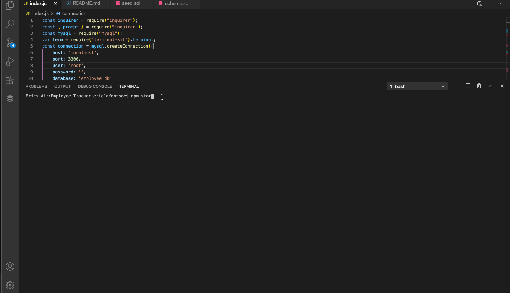

# Employee-Tracker

## Description
For this project, I created a CLI application that can manage a company's employees. This Content Management System  
allows the user to view, add, delete, and update departments, roles, and employees.

View a full demo here: https://drive.google.com/file/d/1bwvdGhdnEXA_C8qCx2j2WkBCmHRg0gyG/view
## Table Of Contents
* [Usage](#Usage)
* [Prerequisites](#Prerequisites)
* [Installation](#Installation)
* [BuiltWith](#Built-With)
* [License](#License)
* [Author](#Author)
* [Questions](#Questions)
* [Acknowledgements](#Acknowledgements )

## Usage
To run the app, navigate to your working directory in the integrated terminal and type ```npm start```




## Prerequisites
To build or edit this application, you will need VS Code, or any IDE, as well as node.js installed.

## Installation
* When you first set up the project, open up the integrated terminal in VS Code and navigate to the root directory of your project. If there is not a package.json then input:  
```npm init -y```

* A package.json file should appear. Then enter the following into your terminal:  
```npm install express --save ```

* Next enter the following into your terminal:  
```npm install mysql --save ```

* Finally enter the following into your terminal:  
```npm install terminal-kit --save ```

* In your package.json under scripts, enter:  
```"start": "node index.js"```

* In a schema.sql file, create your database:  
```CREATE DATABASE employee_db;```

* To run the application, enter:  
```npm start```


## Built-With
Node.js  
JavaScript  
MySQL
NPM.js Terminal-kit

## License 
This project is licensed under MIT. 


## Author
Eric LaFontsee 

## Questions
If you have any additional questions you can contact me here:  
GitHub: https://github.com/ericlafontsee   
elafontsee@gmail.com

## Acknowledgements 
Sangeetha Kaliaperumal - Trilogy  
    * Helped debugging 
Anthony Cooper - Trilogy  
    * Code revisions  
Brendon Conatser - Classmate  
    * Collaborated on the project  


